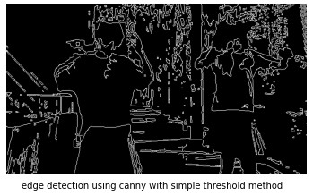
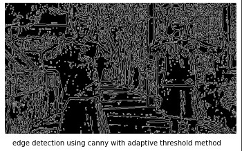
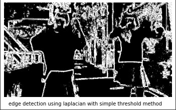
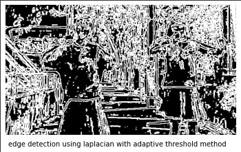
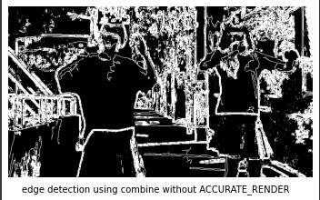
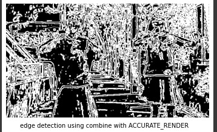

# Desmos-render

This is library to using desmos to render any frames.

## 1. HOW

Every frames will be **edge detected** using python. Then, the edge detected images will be traced using potrace resulting in a bezier curves. The bezier curves will be saved inside a .txt file and then will be fed to the **desmos API** to be rendered using **Node.js** server.

### 1.1 Edge Detection

The edge detection algorithm that is supported is canny edge detection, laplacian edge detection, and combine method(using canny and laplacian).

#### 1.1.1 Canny

The canny filter takes two arguments, low threshold and high threshold. Each of them will used an adaptive thresholding where $lowThresholding= (1- nudge) * medianPixels$ and $highThreshold=(1 + nudge) * medianPixels$.

Before the images goes to the canny filter, it goes to a few preprocessing layer such as gaussian filter to filter out the noise, bilateral filter to smoothen the filter and threshold the images. Threshold images can be done using two methods : simple and adaptive. 
__Threshold Method__:
For simple, the kernel is cv2.THRESH_TOZERO
For adaptive, the kernel is cv2.ADAPTIVE_THRESH_GAUSSIAN_C and cv2.THRESH_BINARY

##### 1.1.1.1 Canny Edge Detection Result

#### 1.1.2 Laplacian
Laplacian takes kzize as argument. ksize specifies the kernel size use to do the filtering. 
Like canny method, before process occurs, the images goes to preprocessing layers like stated in canny filter in 1.1.2. 
__Threshold Method__:
For simple, the kernel is cv2.THRESH_TRUNC
For adaptive, the kernel is cv2.ADAPTIVE_THRESH_GAUSSIAN_C and cv2.THRESH_BINARY

##### 1.1.2.1 Laplacian Edge Detection Result 

### 1.1.3 Combine
Combine use laplacian and canny filter. Then the result will be a weighted average of laplacian result and canny result. The weight of the filter is specified in factor parameter. 
__Accurate Render Parameters__:
If accurate render is not set, then each filter will use simple threshold method. 
if accurate render is set, then laplacian filter will use adaptive threshold method and canny still use simple method. 
##### 1.1.3.1 Laplacian Edge Detection Result 

