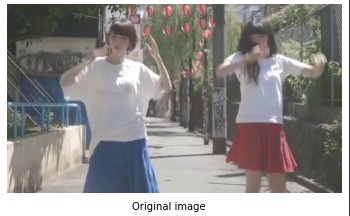

# Desmos-render

This is library to using desmos to render any frames.

## 1. HOW

Every frames will be **edge detected** using python. Then, the edge detected images will be traced using potrace resulting in a bezier curves. The bezier curves will be saved inside a .txt file and then will be fed to the **desmos API** to be rendered using **Node.js** server.

### 1.1 Edge Detection

The edge detection algorithm that is supported is canny edge detection, laplacian edge detection, and combine method(using canny and laplacian).

#### 1.1.1 Canny

The canny filter takes two arguments, low threshold and high threshold. Each of them will used an adaptive thresholding where $lowThresholding= (1- nudge) * medianPixels$ and $highThreshold=(1 + nudge) * medianPixels$.

Before the images goes to the canny filter, it goes to a few preprocessing layer such as gaussian filter to filter out the noise, bilateral filter to smoothen the filter and threshold the images. Threshold images can be done using two methods : simple and adaptive. 
__Threshold Method__:
\
For simple, the kernel is cv2.THRESH_TOZERO
\
For adaptive, the kernel is cv2.ADAPTIVE_THRESH_GAUSSIAN_C and cv2.THRESH_BINARY

##### 1.1.1.1 Canny Edge Detection Result



#### 1.1.2 Laplacian
Laplacian takes kzize as argument. ksize specifies the kernel size use to do the filtering. 
Like canny method, before process occurs, the images goes to preprocessing layers like stated in canny filter in 1.1.2. 
__Threshold Method__:
\
For simple, the kernel is cv2.THRESH_TRUNC
\
For adaptive, the kernel is cv2.ADAPTIVE_THRESH_GAUSSIAN_C and cv2.THRESH_BINARY

##### 1.1.2.1 Laplacian Edge Detection Result 


### 1.1.3 Combine
Combine use laplacian and canny filter. Then the result will be a weighted average of laplacian result and canny result. The weight of the filter is specified in factor parameter. 
__Accurate Render Parameters__:
\
If accurate render is not set, then each filter will use simple threshold method. 
\
if accurate render is set, then laplacian filter will use adaptive threshold method and canny still use simple method. 
##### 1.1.3.1 Laplacian Edge Detection Result 


## 2. Requirements
1. Python 3.8+
2. FFMPEG
3. yt-dlp (https://github.com/yt-dlp/yt-dlp)
### Python Library
1. potrace
2. numpy
3. opencv

### 3. Running
Here is how to run the script
```shell
python3 start.py (specify options that want to be used. Read 3.1)
```
#### 3.1. Options
| ARGS | Details |
| :--- | :--- |
| -g | Only download video from youtube
| -h | Show Help |
| -f | Change the filename of the frames. Default = "out" |
| -e | Change the extension of the frames. Default = "png" | 
| --url | usage= --url=\<youtube url>. Youtube video link that want to be processed. Use this option if you want to render video from youtube. If you use this options, no need to specify path 
|--vid_path | usage= --vid_path=\<video_path>.  Video path using relative path. Specify this option if you want to render using existing video. Use --frame_path, --out_path_images, and --latex to specify output location
| --fps | usage= --fps=\<frame per second>. Specify how often FFMPEG take snapshot of the video. More FPS means a lot more frames -> more smooth
| --frame_path | usage= --frame_path=\<frame_path> Frame input path(Use relative path).
| --out_path_images | usage= --out_path_images=\<out_path_images>. Desmos rendered frames location. Default location /out_png/default.
| --latex | usage= --latex=\<out_latex_path>. Use this to specify latex output path when using --frame_path option
| --batch_size | usage = --batch_size=\<size>. How many frames want to be computed per batch before save to a file. Can reduce memory consumption. 
| --edge_method | usage = --edge_method=\<edge_method>. Specify the method that want to be used to detect edges. Available option are:</br>1. canny (use --threshold_method opts to specify the Threshold Method. Default is "simple")</br>2. laplacian (--threshold_method opts to specify the Threshold Method. Default is "simple")</br>3. combine : combine laplacian and canny method(use --acurrate flag to give a much more accurate representation of the images
|--threshold_method| usage= --threshold_method=\<THRESHOLD_METHOD>: Specify the threshold method used. Only applicable to edge method : __canny__ and __laplacian__. Available options : __simple__ and __adaptive__|
|--accurate| usage= --accurate. Accurate render. Give a close representation to the original images. Can lead to a noisy result. Only applicable if used __combine__ edge method.|

#### Notes :
* If used __--url__ options, by default,
	* __frame_path=/frames/video_name__	
	* __out_latex_path=/out_latex/video_name__
	* __out_images_path=/out_png/video_name__
* To be able to process images there need to be __--url__, __--frame_path__, or __--vid_path__ specified. If not, the program will stop

#### 3.2. Example
```shell
python3 start.py --url=https://www.youtube.com/watch?v=GQ3V50XoLOM --fps=10 --batch_size=500 --edge_method=combine --accurate
```
